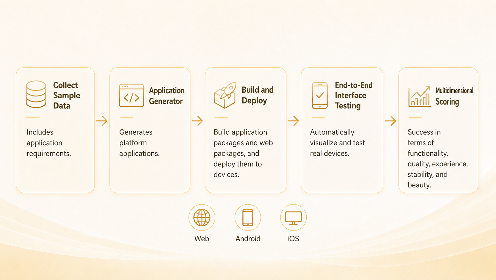
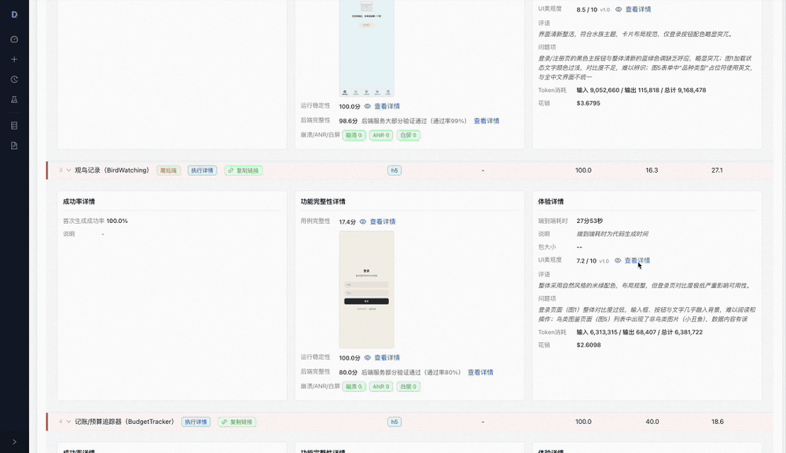

<div align="center">

# daimax-appbench

**An automated benchmark platform for AI-generated applications — featuring built-in evaluation rules, standard sample sets, and layered test cases across a multi-dimensional metric system. A single pipeline automatically handles build, install, E2E testing, and scoring, producing a shareable evaluation report.**

[](LICENSE)
[](https://python.org)
[](#supported-platforms)

[**Quick Start**](docs/QuickStart.md) · [**API Reference**](docs/API.md) · [**Architecture**](docs/Architecture.md) · [**Contributing**](CONTRIBUTING.md)

English | [中文](README.zh-CN.md)

</div>

<div align="center">

</div>

---

## Evaluation Report

Every run produces a single, self-contained HTML report that scores the generated app across multiple dimensions and lets you drill into each check:

<div align="center">

</div>

---

## What is daimax-appbench?

**daimax-appbench** is a benchmark platform for measuring the quality of AI-generated applications. Give it an app requirement sample and a produced artifact — a deployed URL, an Android APK, an iOS `.app`, or a source project — and it runs a fully automated pipeline: **build → install → E2E test → multi-dimensional scoring → evaluation report**.

Testing is driven by a vision model that executes and asserts each step in natural language, and every AI capability (E2E model, aesthetics VL model) is wired in through config, so any OpenAI-compatible service can be dropped in. The whole thing runs from the CLI with no human in the loop.

---

## Key Features

- **End-to-end pipeline** — build, install, E2E testing, scoring, and reporting in a single command, with zero manual intervention
- **AI-powered E2E testing** — a vision model executes atomic test steps and replans on the fly when the UI diverges from expectations
- **Evaluation reports** — double-click to open, no server required; total-score cards, per-platform metrics, and per-sample details in one portable file
- **Curated sample datasets** — V1 (basic regression) and V2 (full-feature evaluation), organized by generation → category → sample
- **Zero-config artifact evaluation** — pass a URL, APK, or `.app` and get a score immediately, with no knowledge of the internal workspace layout
- **Pluggable architecture** — register custom generators and CLI subcommands via entry points without touching the core

---

## Evaluation Dimensions

All scores are on a 0–100 scale. Weights, thresholds, and penalty coefficients are centrally defined as a single source of truth in `evalapp/evaluation/metrics/rules.py`.

| Dimension | What it measures | Source |
|---|---|---|
| **Success Rate** | First-time generation success rate (weight 60%) + issue-fix & requirement-extension rates (reserved, 20% each; dynamically normalized when absent) | Build / install / launch gating |
| **Functional Completeness** | Base score = E2E pass rate × 100, minus stability penalty (up to 20%) and backend penalty (up to 30%). Build/install/launch failure forces 0. | E2E results + device logs + network |
| **Experience** | Duration 60% + artifact size 20% + aesthetics 20% (missing sub-dimensions auto-normalized) | Stage timings + artifact size + screenshots |

**Functional Completeness sub-indicators** (not scored independently; feed into the dimension above):
- *Stability*: `max(0, 1 − issue_rate) × 100`, where issues = crash + ANR + white screen. Applied as a deduction factor (up to 20% of the base score).
- *Backend Completeness*: Applied as a deduction factor (up to 30% of the base score). Only active when the sample requires a backend; otherwise no deduction.

**Aesthetics** (20% weight within Experience) — VL-model scoring: Color Harmony 25% + Layout Quality 25% + Visual Hierarchy 20% + Typography 15% + Professionalism 15%. White-screen or load-failure pages are scored as 0 and folded into the weighted average.

> Full metric formulas and penalty models are documented in the [Architecture guide](docs/Architecture.md).

---

## Supported Platforms

The benchmark evaluates three kinds of build artifacts, independent of how they were produced:

| Platform | Artifact type | Input |
|---|---|---|
| **Web** | Web artifact — mini-program, Expo Web, H5, or any deployed web app | Deployed URL (`--url`) |
| **Android** | Android artifact — APK | Prebuilt APK (`--apk`) |
| **iOS** | iOS artifact — `.app` bundle | Prebuilt `.app` (`--app`) |

Platform is inferred automatically from the artifact type; `--project` (source mode) requires an explicit `--platform`.

---

## Benchmark Suite

The project ships with two standardized benchmark suites (under `dataset/`). Every sample follows a unified **Requirement → Case → Step** format, making results reproducible and directly comparable:

| Version | Focus |
|---|---|
| **V1** | Baseline regression — classic categories (tools, games, social, lifestyle, etc.); broad coverage, ideal for fast regression |
| **V2** | Vertical depth — niche domains (beverage, collection, nature, knowledge, etc.); high complexity, most require backend & auth |

**Layered structure** — samples are organized across four levels: dataset → sample → case → step:

```
dataset/
└── sample/
    ├── sample.yaml                  # Requirement definition & metadata
    └── test_cases/
        └── test_cases_default.json  # Layered test cases
```

`sample.yaml` fully describes the requirement (`requirement` text, `core_functions`, `constraints`, `app_type`, plus metadata such as `requires_backend`/`requires_auth`/complexity).

Every sample is driven by structured test cases, keeping the evaluation transparent and auditable — cases are organized as **case → steps**, where each step is a natural-language "action → assertion" pair executed and verified by the vision model:

```json
{
  "id": "TC001",
  "name": "Main menu display",
  "priority": "P0",
  "steps": [
    "Launch the app and enter the main menu -> Expected: game title '2048' is displayed",
    "Check menu buttons -> Expected: [Start Game][Leaderboard][Settings] entries visible",
    "Check high score -> Expected: current high score shown at bottom (0 on first launch)"
  ],
  "expected_result": "Main menu displays title, functional buttons, and high score correctly"
}
```

Case priorities: `P0` (critical path, must pass), `P1` (important features), `P2` (edge cases).

**Bring your own benchmark** — the suite is fully open: use the same format to extend it or build a dedicated benchmark, whether for frontend-only apps, apps with a backend, or any specific category / app type. Any directory following the convention (sub-directories containing `sample.yaml`) can be evaluated directly, and new samples & categories are welcome via PR:

```bash
evalapp evaluate --workspace <workspace> --samples-dir /path/to/your-dataset --platform web
# Evaluate a specific category or specific samples
evalapp evaluate --samples-dir ./dataset/V2/beverage --platform android
evalapp evaluate --samples-dir ./dataset/V2 --sample-ids TeaCeremony,CoffeeRoastLog --platform web
```

---

## Quick Start

**1. Install** — requires Python ≥ 3.10:

```bash
git clone https://github.com/open-daima/daimax-appbench.git
cd daimax-appbench
python -m venv .venv && source .venv/bin/activate
pip install -e .
```

The repository directory is `daimax-appbench`; the installed Python package and CLI command are both `evalapp`.

**2. Configure** — copy the example and fill in your model API keys:

```bash
cp evalapp.yaml.example evalapp.yaml
```

`evalapp.yaml` contains secrets and is already git-ignored — do not commit it.

**3. Run** — pass an artifact and get scored:

```bash
evalapp evaluate --url https://my-app.vercel.app --sample-ids CoffeeRoastLog
```

When the run finishes, a single-file `report.html` is written to the workspace root and opened in your browser (disable with `--no-open-report`).

---

## CLI Overview

| Command | Description |
|---|---|
| `evalapp evaluate` | Evaluate an artifact or source project (build → install → E2E → score → report) |
| `evalapp retest` | Re-run E2E tests and regenerate the report |
| `evalapp report` | Generate or regenerate the report for a completed run |
| `evalapp history` | Show the execution history of a workspace |

See the [API Reference](docs/API.md) for the full option set of every command.

---

## Documentation

- [Quick Start Guide](docs/QuickStart.md) · [快速开始](docs/QuickStart.zh-CN.md)
- [API Reference](docs/API.md) · [API 参考](docs/API.zh-CN.md)
- [Architecture](docs/Architecture.md) — pipeline, metric formulas, dataset & test-case design
- [Dataset Guide](dataset/README.md) — sample structure and execution plans

---

## Running Tests

```bash
pip install -e ".[dev]"
pytest
```

---

## Contributing

Contributions of all kinds are welcome — new metrics, dataset samples, platform support, documentation, and test coverage. Please read [CONTRIBUTING.md](CONTRIBUTING.md) for the workflow, code style, and PR checklist.

---

## License

daimax-appbench is released under the [Apache License, Version 2.0](LICENSE).
