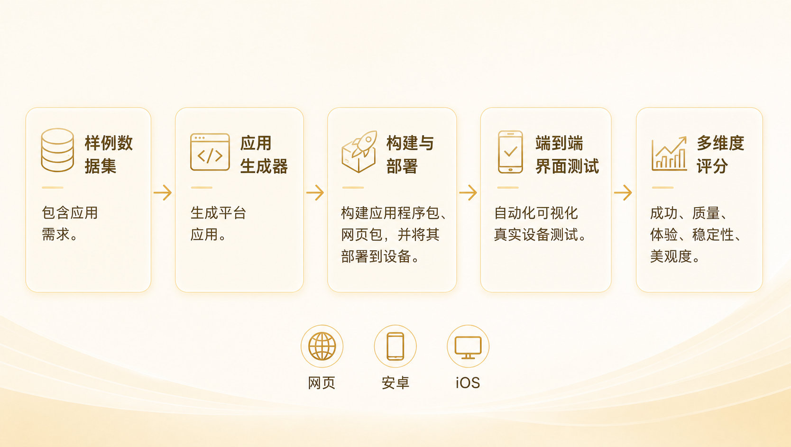
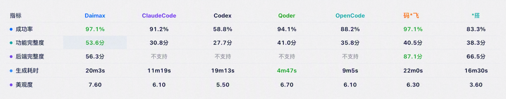

<div align="center">

# daimax-appbench

**面向 AI 生成应用的自动化评测基准平台——内置评测规则、标准样本集与分层用例，覆盖多维度指标体系；一条流水线自动完成构建、安装、E2E 测试与评分，产出可分享的评测报告。**

[](LICENSE)
[](https://python.org)
[](#支持平台)

[**快速开始**](docs/QuickStart.zh-CN.md) · [**API 参考**](docs/API.zh-CN.md) · [**架构**](docs/Architecture.md) · [**贡献指南**](CONTRIBUTING.md) · [**袋马官网**](https://www.daimax.cn/zh-CN)

[English](README.md) | 中文

</div>

<div align="center">

</div>

---

## 评测报告

每次评测都会生成一份自包含的评测报告，对生成应用进行多维度评分，并可逐项下钻查看每一项检查明细：

<div align="center">

</div>

---

## 什么是 daimax-appbench？

**daimax-appbench** 是一个衡量 AI 生成应用质量的评测基准平台。给定一份应用需求样本和一个应用产物——已部署的 URL、Android APK、iOS `.app` 或源码项目——它会自动跑完整条流水线：**构建 → 安装 → E2E 测试 → 多维度评分 → 评测报告**。

测试过程由视觉模型驱动，逐步以自然语言执行并断言；所有 AI 能力（E2E 模型、美观度 VL 模型）均通过配置表接入，可替换为任意 OpenAI 兼容服务。整个过程以 CLI 方式运行，零人工介入。

---

## 核心特性

- **端到端流水线** — 构建、安装、E2E 测试、评分与报告一条命令跑完，全程零人工介入
- **AI 视觉驱动的 E2E 测试** — 视觉模型逐条执行原子化用例，当界面与预期不符时自动重规划
- **评测报告** — 双击即开，无需任何服务；总分卡片、分平台指标、逐样本明细集于一份可移动的文件
- **精选样本数据集** — V1（基础回归）与 V2（全功能评测），按代际 → 类别 → 样本三级组织
- **零配置产物评测** — 传入 URL、APK 或 `.app` 即可立即评分，无需了解内部工作区结构
- **插件化架构** — 通过 entry point 注册自定义生成器与 CLI 子命令，无需改动核心代码

---

## 评测维度

所有得分均为 0–100 分。权重、阈值与扣分系数集中定义在 `evalapp/evaluation/metrics/rules.py`（单一事实来源）。

| 维度 | 衡量内容 | 数据来源 |
|---|---|---|
| **成功率 Success Rate** | 首次生成成功率（权重 60%）+ 问题修复率 / 补充需求率（各 20%，预留；缺失时动态归一化） | 构建 / 安装 / 启动门控 |
| **功能完整性 Functional Completeness** | 基础分 = E2E 用例通过率 × 100，减去稳定性扣分（最多 20%）和后端扣分（最多 30%）。构建/安装/启动失败强制 0 分。 | E2E 结果 + 设备日志 + 网络请求 |
| **体验 Experience** | 耗时 60% + 包大小 20% + 美观度 20%（缺失维度自动归一化） | 各阶段耗时 + 产物体积 + 截图 |

**功能完整性子指标**（不独立计分，作为上述维度的扣分因子）：
- *运行稳定性*：`max(0, 1 − 问题率) × 100`，问题 = crash + ANR + 白屏。作为扣分因子参与功能完整性计算（最多扣基础分的 20%）。
- *后端完整性*：作为扣分因子（最多扣基础分的 30%）。仅 requires_backend=true 的样本生效，缺失时不扣分。

**美观度**（体验维度内 20% 权重）—— VL 模型按加权评分表打分：配色 25% + 布局 25% + 视觉层次 20% + 字体 15% + 专业感 15%。白屏或加载失败页按 0 分计入加权均值，拉低整体得分。

> 完整的指标计算公式与扣分模型详见[架构文档](docs/Architecture.md)。

---

## Agent 榜单

以下是用本框架实测主流 AI 编程 Agent 与应用生成平台的结果——评测规则与流水线完全一致，全程零人工介入：

<div align="center">

</div>

**这些指标对一个应用意味着什么**

| 指标 | 对应用的意义 | 怎么看这个数 |
|---|---|---|
| **成功率** | 产物能否交付的底线——构建失败、装不上、一启动就崩，后面所有维度都无从谈起 | 这是及格线而非优势项；每下降一个百分点，都意味着多一批需要人工救火的废片 |
| **功能完整度** | 需求里的功能点真正被实现了多少。能跑起来但功能缺一半的应用，等于没做完 | 最值得看重的一项——它直接对应「拿到产物后还要补多少人工」 |
| **后端完整度** | 数据能否持久化、接口是否真的连通——区分「能演示的 Demo」和「能用的产品」 | 仅具备后端生成能力的产品有此项；页面再漂亮，数据存不下来就只是原型 |
| **生成耗时** | 决定迭代节奏。几分钟可以反复试错、随时改需求；二十分钟以上就变成「提交任务等结果」 | 必须和成功率、功能完整度一起看——快而常失败，不如慢而稳 |
| **美观度** | C 端应用留存的第一道门槛，用户往往在几秒内就因为界面粗糙而流失 | 也决定了拿到产物后 UI 还要不要重做 |

> 榜单中的成功率与功能完整度对应上文[评测维度](#评测维度)的同名维度；后端完整度是功能完整性的扣分因子，生成耗时与美观度是体验维度的组成部分，此处单列以便直接横向对比。

---

## 接入你的生成 Agent

评测框架本身不含任何生成器实现——**任何能产出应用的 Agent 或平台都能接进来评测**，包括闭源的商业产品。上面榜单中的各家正是通过下面两种方式接入的。

### 方式一：直接评测产物（无需写代码）

Agent 生成完，把产物交给评测框架即可：

```bash
evalapp evaluate --url https://your-app.vercel.app        # Web
evalapp evaluate --apk ./your-app.apk                     # Android
evalapp evaluate --app ./YourApp.app                      # iOS
evalapp evaluate --project ./your-project --platform web   # 源码项目
```

适用于任意 Agent、任意技术栈——框架只看产物，不关心它怎么来的。

### 方式二：插件接入（全自动批量评测）

实现 `AppGenerator` 接口，让框架直接驱动你的 Agent 跑完「生成 → 评测」全流程，一条命令扫完整个样本集：

```python
import shutil
from evalapp.generators import AppGenerator, GenerationResult

class MyAgentGenerator(AppGenerator):
    name = "myagent"                       # 非空即自动注册
    supported_platforms = ["web", "android"]

    def is_available(self) -> bool:
        return shutil.which("myagent-cli") is not None

    def generate(self, prompt_text, platform, session_id=None,
                 workspace_dir=None, constraints=None) -> GenerationResult:
        # 调用你的 Agent，产出源码项目目录或已部署 URL
        return GenerationResult(
            success=True, platform=platform,
            project_path="/path/to/generated/project",  # 源码产物
            h5_url="",                                   # 或 Web 部署地址
        )
```

在你自己的包里声明 entry point，`pip install` 后即被自动发现，**无需改动本仓任何代码**：

```toml
[project.entry-points."evalapp.generators"]
myagent = "my_pkg.generators:MyAgentGenerator"
```

然后指定生成器批量评测：

```bash
evalapp evaluate --workspace ./ws --samples-dir ./dataset/V2 --platform web --generator myagent
```

生成器还可选实现 `setup()` / `teardown()` / `validate_config()` / `resume()` 等生命周期钩子；接口详情见 [API 参考](docs/API.zh-CN.md)。

---

## 支持平台

评测支持三类产物，不限定其生成方式：

| 平台 | 产物类型 | 产物输入 |
|---|---|---|
| **Web** | Web 产物 —— 小程序 / Expo Web / H5 等任意可访问的 Web 应用 | 已部署 URL（`--url`） |
| **Android** | Android 产物 —— APK | 预构建 APK（`--apk`） |
| **iOS** | iOS 产物 —— `.app` | 预构建 `.app`（`--app`） |

平台按产物类型自动推断；`--project`（源码模式）需显式指定 `--platform`。

---

## 基准样本集

本项目内置两套标准化基准样本集（位于 `dataset/`）。所有样本采用统一的「需求 → 用例 → 步骤」格式，评测结果可复现、可横向对比：

| 版本 | 侧重 |
|---|---|
| **V1** | 基线回归——工具、游戏、社交、生活等经典品类，覆盖面广，适合快速回归 |
| **V2** | 垂直深度——饮品、收藏、自然观察、知识等垂直领域，复杂度高，多数含后端与登录 |

**分层结构** —— 评测样本采用 数据集 → 样本 → 用例 → 步骤 四级组织：

```
dataset/
└── 样本(sample)/
    ├── sample.yaml                  # 需求定义与元数据
    └── test_cases/
        └── test_cases_default.json  # 分层测试用例集
```

`sample.yaml` 定义需求全貌（`requirement` 需求描述、`core_functions` 核心功能、`constraints` 约束、`app_type` 应用类型，以及 `requires_backend`/`requires_auth`/复杂度等元数据）。

每个样本都由结构化用例驱动，评测过程透明可查——用例按「用例 → 步骤」组织，每个步骤以自然语言描述「操作 → 预期」，由视觉模型逐条执行并校验断言：

```json
{
  "id": "TC001",
  "name": "主菜单页面展示",
  "priority": "P0",
  "steps": [
    "启动应用进入主菜单 -> 预期: 显示游戏标题'2048'",
    "检查菜单按钮 -> 预期: 显示[开始游戏][排行榜][设置]入口",
    "检查最高分 -> 预期: 底部显示当前最高分（首次为0）"
  ],
  "expected_result": "主菜单完整显示标题、功能按钮和最高分"
}
```

用例优先级：`P0`（核心路径必过）、`P1`（重要功能）、`P2`（边缘场景）。

**贡献你自己的基准** —— 样本集完全开放：用同一套格式即可扩展或搭建专属基准，无论是纯前端应用、带后端的应用，还是特定品类 / 应用类型。只要目录符合约定（子目录含 `sample.yaml`），即可直接用于评测，也欢迎通过 PR 贡献新样本与品类：

```bash
evalapp evaluate --workspace <工作区> --samples-dir /path/to/your-dataset --platform web
# 只评测某个品类或指定样本
evalapp evaluate --samples-dir ./dataset/V2/beverage --platform android
evalapp evaluate --samples-dir ./dataset/V2 --sample-ids TeaCeremony,CoffeeRoastLog --platform web
```

---

## 快速开始

**1. 安装** — 要求 Python ≥ 3.10：

```bash
git clone https://github.com/open-daima/daimax-appbench.git
cd daimax-appbench
python -m venv .venv && source .venv/bin/activate
pip install -e .
```

仓库目录名为 `daimax-appbench`，安装后的 Python 包与 CLI 命令均为 `evalapp`。

**2. 配置** — 复制示例文件并填入模型 API Key：

```bash
cp evalapp.yaml.example evalapp.yaml
```

`evalapp.yaml` 含密钥，已被 `.gitignore` 忽略，请勿提交。

**3. 运行** — 传入产物即可评分：

```bash
evalapp evaluate --url https://my-app.vercel.app --sample-ids CoffeeRoastLog
```

运行结束后，工作区根目录会生成单文件 `report.html` 并自动在浏览器打开（可用 `--no-open-report` 关闭）。

> 手上还没有可评测的应用？到 [袋马](https://www.daimax.cn/zh-CN) 用一句话描述想法，几分钟就能拿到一个可运行的应用，再把 `--url` 指向它看看能打多少分。

---

## CLI 命令总览

| 命令 | 说明 |
|---|---|
| `evalapp evaluate` | 评测产物或源码项目（构建 → 安装 → E2E → 评分 → 报告） |
| `evalapp retest` | 重跑 E2E 测试并重新生成报告 |
| `evalapp report` | 为已完成的评测生成 / 重新生成报告 |
| `evalapp history` | 查看工作区的执行历史记录 |

各命令的完整参数说明见 [API 参考](docs/API.zh-CN.md)。

---

## 文档

- [快速开始指南](docs/QuickStart.zh-CN.md) · [Quick Start](docs/QuickStart.md)
- [API 参考](docs/API.zh-CN.md) · [API Reference](docs/API.md)
- [架构文档](docs/Architecture.md) — 流水线、指标计算公式、数据集与用例设计
- [数据集指南](dataset/README.md) — 样本结构与执行计划

---

## 运行测试

```bash
pip install -e ".[dev]"
pytest
```

---

## 贡献指南

欢迎各种形式的贡献——新增指标、数据集样本、平台支持、文档完善与测试覆盖。提交 Pull Request 前，请阅读 [CONTRIBUTING.md](CONTRIBUTING.md) 了解工作流、代码风格与 PR 检查清单。

---

## 关于袋马

daimax-appbench 出自 [袋马 DAIMAX](https://www.daimax.cn/zh-CN)——一个 AI 驱动的应用工厂：用自然语言描述想法，平台自动完成需求拆解、界面设计、代码生成、实时预览与多轮迭代，产出可上线的小程序、H5 与跨端应用。

这套评测基准正是我们用来检验自家生成应用质量的工具。如果你也感兴趣，欢迎到 [www.daimax.cn](https://www.daimax.cn/zh-CN) 体验一下。

---

## 许可证

daimax-appbench 基于 [Apache License, Version 2.0](LICENSE) 发布。
